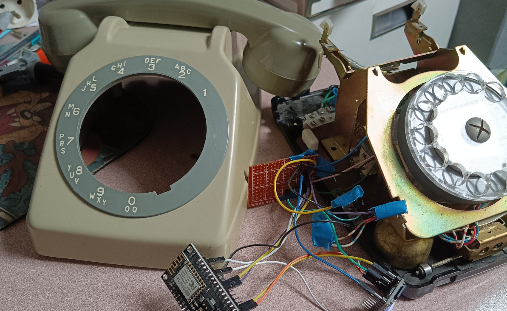
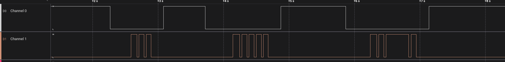

# pyPhone

Projet de détournement d'un ancien téléphone ☎ à cadran.
De la musique (ou autre fichier mp3) est diffusée dans le combiné lorsqu'il est décroché.
Le cadran permet de choisir la piste à lire.



## Pré-requis

### Hardware


- ESP8266-12F (Nodemcu) flashée avec [MicroPython](https://micropython.org)
- [DFPlayer mini](https://wiki.dfrobot.com/DFPlayer_Mini_SKU_DFR0299) + carte Micro SD


### Software

- [esptools](https://github.com/espressif/esptool) pour flasher la carte (`esptool.py --port /dev/ttyUSB0 --baud 460800 write_flash --flash_size=detect 0 ESP8266_GENERIC-20231005-v1.21.0.bin`)
- [ampy](https://github.com/scientifichackers/ampy) pour uploader le code (`ampy --port /dev/ttyUSB0 put pyphone/main.py`)
- [picocom](https://github.com/npat-efault/picocom) pour accéder au REPL via le port série ( `picocom /dev/ttyUSB0 -b 115200`)


## Montage

NodeMCU **D1** : Combiné (0V si décroché, PULLUP si raccroché)

NodeMCU **D4** : **RX** DFPlayer (Transmission de commande lecture/stop)

NodeMCU **D5** : Cadran fil bleu (cf. infra) - Indique si on touche le cadran

NodeMCU **D6** : Cadran fil rouge (cf. infra) - Renvoi les impulsions quand le cadran est relaché

DFPlayer **SPK_2** : Haut-parleur du combiné, fil bleu clair (ajouter une resistance de 4,7k pour atténuer le volume (parasites possibles si resistance trop faible)). Tester également avec **DAC_L**.

Ne pas oublier la **masse** pour le nodeMCU, DFPlayer, Haut-parleur (fil rouge (!)) et cadran (fils bleu-blanc et rouge-blanc).

## Carde SD

Arborescence : 

Les répertoires 001 à 010 correspondent au numéro choisi sur le cadran (`010` pour le zéro).
Le répartoire `099` est lu en boucle lorsque le combiné est décroché (tonalité d'attente).

Seul le canal gauche est envoyé au combiné.

```
.
├── 001/
│   ├── 001_title.mp3
│   ├── 002_title.mp3
│   └── 003_title.mp3
├── 002/
│   ├── 001_title.mp3
│   ├── 002_title.mp3
│   └── 003_title.mp3
├── ...
├── 010/
│   ├── 001_title.mp3
│   ├── 002_title.mp3
│   └── 003_title.mp3
├── 098/
│   └── 001_nouveau_message.mp3
└── 099/
    └── 001_waiting_tone.mp3
```


## Cadran



La lecture du signal des fils rouge et bleu du cadran permet de récuperer la valeur (1-10) choisie
par l'utilisateur.

Le signal bleu (_channel 0_) est `TRUE` en temps normal, il passe à `FALSE` dès que l'utilisateur
actionne le cadran.

Le signal rouge (_channel 1_) est `FALSE`. Il emet _n_ impulsion `TRUE` lorsque le cadran est relaché.
La durée d'une impulsion est d'environ 75ms, mais elle est dépendante de la vitesse 
à laquelle le cadran tourne après avoir été relaché. Si l'utilisateur freine le cadran, 
la durée des impulsions peut être fortement rallongée (_cf._ capture). Le temps entre 2 impulsions est
plus stable (~30ms).

## Remericements

Les contributeurs de [micropython-dfplayer](https://github.com/redoxcode/micropython-dfplayer)
