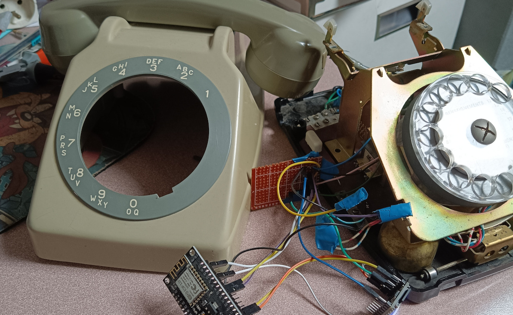
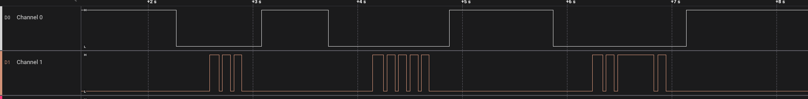

# pyPhone

Projet de détournement d'un ancien téléphone ☎ à cadran.
De la musique (ou autre fichier mp3) est diffusée dans le combiné lorsqu'il est décroché.
Le cadran permet de choisir la piste à lire.

## Pré-requis

### Hardware

- ESP32-S3 (avec PSRAM).
- Amplificateur I2S MAX98357A.

### Software

Le projet utilise [ESPHome](https://esphome.io/) pour générer le firmware de l’ESP

## Montage

ESP32 **GPIO5** : Combiné (0V si décroché, PULLUP si raccroché)

ESP32 **GPIO10** : MAX98357A - BCLK

ESP32 **GPIO11** : MAX98357A - LRC

ESP32 **GPIO12** : MAX98357A - DIN

ESP32 **GPIO4** : Cadran fil bleu (cf. infra) - Indique si on touche le cadran

ESP32 **GPIO6** : Cadran fil rouge (cf. infra) - Renvoi les impulsions quand le cadran est relaché

## Serveur

Serveur FastAPI. Il permet de renvoyer les fichires sons (statiques) mais aussi des générer des phrases avec PiperVoice.

L'ESP-32 transmet au serveur : les actions le combiné (_hangup_ / _pickup_) et le numéro choisi sur le cadran (1 à 10).

Pour ne pas surcharger l'ESP32,le serveur stream en wav, 8khz, mono.

Fonctionnalités :
- Stream
- Serveur Vocal Interactif
- Génération de phrase aléatoires

TODO : image docker à construire.

## Cadran

La lecture du signal des fils rouge et bleu du cadran permet de récuperer la valeur (1-10) choisie
par l'utilisateur.

Le signal bleu (_channel 0_) est `TRUE` en temps normal, il passe à `FALSE` dès que l'utilisateur
actionne le cadran.

Le signal rouge (_channel 1_) est `FALSE`. Il emet _n_ impulsion `TRUE` lorsque le cadran est relaché.
La durée d'une impulsion est d'environ 75ms, mais elle est dépendante de la vitesse 
à laquelle le cadran tourne après avoir été relaché. Si l'utilisateur freine le cadran, 
la durée des impulsions peut être fortement rallongée (_cf._ capture). Le temps entre 2 impulsions est
plus stable (~30ms).

## Remericements

Les contributeurs de [micropython-dfplayer](https://github.com/redoxcode/micropython-dfplayer)
